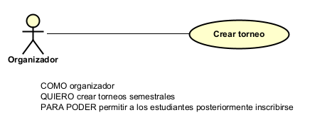
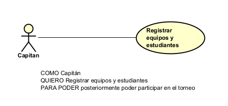
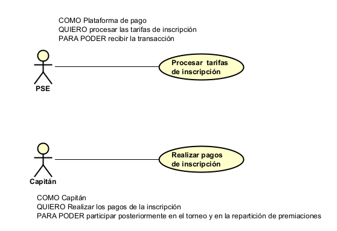

# 📄 Requerimientos del Sistema

## 1. Lista general de requerimientos

El sistema de Tech-Cup tiene los siguientes requerimientos:
1. La creación de torneos e inscripción de equipos.
2. La capacidad de crear registros requeridos.

### 1.1 Requerimientos funcionales

El sistema de Tech-Cup debe tener la capacidad de:

1. Permitir la creación de torneos semestrales utilizando un identificador único de 5 dígitos.
2. Permitir a los capitanes registrar equipos y asociar a los estudiantes integrantes.
3. Integrar la pasarela de pagos externa (PSE) para procesar las tarifas de inscripción.
4. Generar y exportar reportes automáticos en formato JSON dirigidos a la Oficina del Decano.
5. Permitir a los organizadores programar partidos, asignar canchas y actualizar los resultados de los encuentros de los torneos.
6. Generar reportes de equipos creados y de ingresos gracias a un torneo.

### 1.2 Requerimientos no funcionales

El sistema de Tech-Cup debe tener:

1. Tiempos de respuesta menores a 2 segundos en la carga de vistas y consulta del calendario.
2. Integridad de datos que impida el borrado físico de los torneos y pagos.
3. Una interfaz web responsiva, accesible desde dispositivos móviles y computadoras de escritorio.
4. Comunicación segura y encriptada para todas las integraciones con la pasarela PSE.
5. Alta disponibilidad (99.9% uptime) durante las fechas límite de inscripción y pago de equipos.

## 2. Diagramas de caso de uso

### 2.1 Requerimiento Funcional 1

| Campo | Descripción |
|------|-------------|
| **ID** | RF-01 |
| **Nombre del requerimiento** |Creación de un torneo |
| **Descripción** |El sistema debe permitir la creación de torneos semestrales.|
| **Precondiciones** | Para que el sistema cumpla con este requerimiento, no debe existir otro torneo activo o en curso.|
| **Actor** | Organizador|
| **Flujo principal** | 1. El actor ingresa la opción de crear torneo. 2. El sistema solicita la información básica. 3. El sistema valida los datos y guarda el torneo en estado pendiente. |
| **Diagrama de caso de uso** | ()|
| **Poscondiciones** | El torneo debe de terminar creado y en estado pendiente.|

### 2.2 Requerimiento Funcional 2

| Campo | Descripción |
|------|-------------|
| **ID** | RF-02 |
| **Nombre del requerimiento** | Capacidad de registros|
| **Descripción** | Registro de equipos y estudiantes|
| **Precondiciones** |Para que el sistema cumpla con este requerimiento, debe existir un torneo creado y en fase de inscripción. |
| **Actor** | Capitán |
| **Flujo principal** |1. El actor selecciona inscribir un nuevo equipo.
 
2. El sistema solicita el nombre del equipo y los códigos de los estudiantes.
 
3. El sistema asocia los integrantes y deja el equipo en estado "Pendiente de pago". |
| **Diagrama de caso de uso** | |
| **Poscondiciones** |Se espera como resultado el equipo y sus integrantes registrados exitosamente.|

### 2.3 Requerimiento Funcional 3

| Campo | Descripción |
|------|-------------|
| **ID** | RF-03 |
| **Nombre del requerimiento** | Procesamiento de pago por PSE|
| **Descripción** | El sistema debe integrar la pasarela de pagos externa (PSE) para procesar las tarifas de inscripción. |
| **Precondiciones** | Para que el sistema cumpla con este requerimiento, el equipo debe estar registrado en estado "Pendiente de pago". |
| **Actor** | Capitán / PSE |
| **Flujo principal** | 1. El actor inicia el proceso de pago.
 
2. El sistema envía los datos de la transacción a PSE.
 
3. El sistema recibe la validación del pago desde PSE y actualiza el estado del equipo a "Inscrito". |
| **Diagrama de caso de uso** | |
| **Poscondiciones** | Se espera como resultado la confirmación del pago y la inscripción. |

### 2.4 Requerimiento Funcional 4

| Campo | Descripción |
|------|-------------|
| **ID** | RF-04 |
| **Nombre del requerimiento** | Generación de reportes JSON|
| **Descripción** | El sistema debe generar y exportar reportes automáticos en formato JSON dirigidos a la Oficina del Decano. |
| **Precondiciones** |Para que el sistema cumpla con este requerimiento, deben existir equipos inscritos con pagos validados. |
| **Actor** | Capitán / Decano |
| **Flujo principal** | 1. El capitán termina de hacer el pago a través de PSE.
 
2. El sistema consolida la información de equipos y pagos.
 
3. El sistema exporta y descarga un archivo en formato JSON.
 
4. El sistema envvía el archivo al decano. |
| **Diagrama de caso de uso** | |
| **Poscondiciones** | Se espera como resultado el archivo JSON enviado a el Decano. |

### 2.5 Requerimiento Funcional 5

| Campo | Descripción |
|------|-------------|
| **ID** | RF-05 |
| **Nombre del requerimiento** | Programación de partidos y resultados|
| **Descripción** |El sistema debe permitir a los organizadores programar partidos, asignar canchas y actualizar los resultados de los encuentros de los torneos. |
| **Precondiciones** |Para que el sistema cumpla con este requerimiento, el torneo debe tener equipos confirmados e inscritos. |
| **Actor** |Organizador |
| **Flujo principal** |1. El actor asigna dos equipos a una fecha y cancha específica.
 
2. El sistema guarda la programación del partido.
 
3. Una vez jugado, el actor ingresa el marcador y el sistema actualiza la tabla de resultados.|
| **Diagrama de caso de uso** | |
| **Poscondiciones** | Se espera como resultado el calendario actualizado y los marcadores guardados. |

## 3. Preguntas
Do you identify any requirement that needs to be further detailed? Which one(s)?
Podrían decir mejor exactamente qué datos quieren en los reportes de los registros de los equipos, qué datos se requiere enviar en el JSON al decano, cómo vamos a calcular la ganancia de un torneo, si sólo es el dinero generado o van a presentar los gastos.

Are there any requirements that contradict each other? Which one(s)?
Sí, el requerimiento funcional sobre la inmutabilidad de los torneos, ya que en las reglas de negocio se dice que no puede ser eliminado, sin embargo, en funcionalidades se pide que se puedan eliminar los torneos, por lo que decidimos que no se puedan eliminar, porque queremos preservar un historial de todos los partidos por si en algun momento es necesario, por lo que si no se quiere seguir con un partido, se utiliza el estado de cancelado.

If you had to prioritize the requirements, which 2 requirements should be considered the most important and implemented in the first iteration of the project?
La capacidad de registro de los usuarios para poder crear los equipos, la creación de torneos e inscripción de las personas al mismo.

Is there any requirement that should not be implemented?
El único que pensamos que no se debería implementar es el cual nos pide que se puedan eliminar torneos.